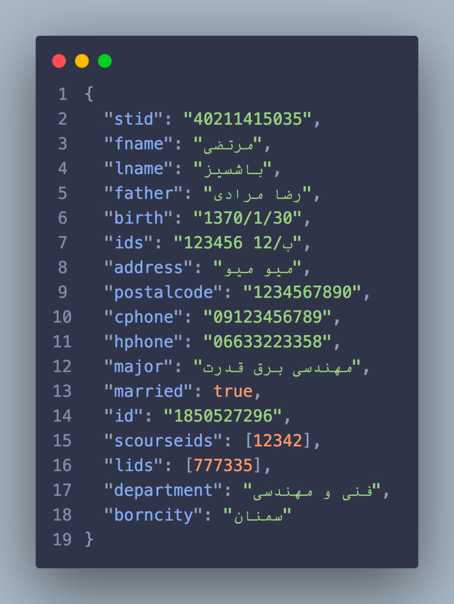
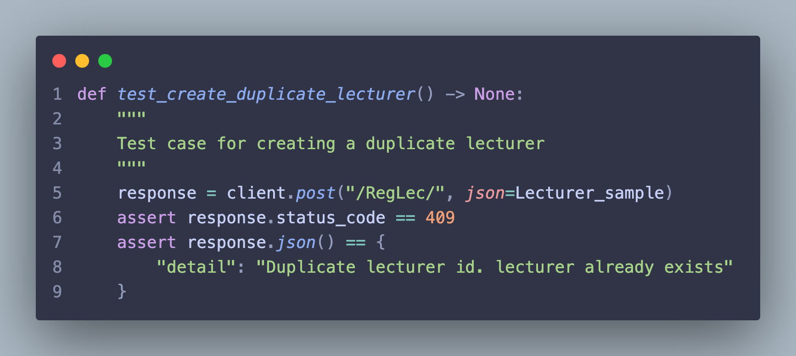

# سیستم مدیریت دانشگاهی بر پایه FastAPI

## نحوه انجام عملیات های CRUD

### عملیات درج (Create)

ورودی: مشخصات دانشجو را به عنوان ورودی وارد میکنیم

روتر Post بر اساس Scheme مشخص شده ورودی را دریافت و پردازش میکند

داده ها قبل از ثبت در پایگاه داده طبق استاندارد های تایین شده صحت سنجی میشوند.
صحت سنجی ها در فایل datavalidation.py تعبیه شده و در روتر مربوطه مورد استفاده قرار میگیرند

در نمونه فوق صحت سنجی مربوط به تکراری نبودن شماره دانشجویی فراخوانی شده که بصورت زیر عمل میکند

همانطور که مشاهده میشود برای صحت سنجی در مثال بالا اگر شماره دانشجویی ای که میخواهیم ثبت کنیم در پایگاه داده وجود داشته باشد ارور مناسب را دریافت میکنیم

و درصورتی که به ارور بر نخوریم رکورد ورودی در پایگاه داده ثبت خواهد شد و طبق response model چهار فیلد اولیه بازگردانی خواهد شد

### عملیات ثبت (Read)

ورودی: شماره دانشجویی

روتر Get بر اساس شماره دانشجویی به دیتابیس درخواست فرستاده و رکورد مربوط به دانشجو را دریافت میکند

### عملیات آپدیت (Update)

ورودی: شماره دانشجویی و پارامتر هایی که میخواهیم آپدیت کنیم

پارامتر های مدنظر بعد از دریافت شدن توسط روتر Patch به json تبدیل میشوند و مقادیر None از json حذف میشود

سپس صحت سنجی روی مقادیر ورودی انجام شده و درصورت نبود ارور مقادیر تمدید شده و به عنوان خروجی باز گردانده میشوند

### عملیات حذف (Delete)

ورودی: شماره دانشجویی

شماره دانشجویی توسط روتر Delete دریافت شده و رکورد دانشجوی مدنظر از پایگاه داده حذف میشود و سپس پیام تایید به علاوه شماره دانشجوی مدنظر بازگردانده میشود

## داکرایز کردن پروژه (Containerization)

### بخش Fastapi

1- کانتینر با آخرین ورژن پایتون آماده میشود

2- مسیر اصلی پروژه را مشخص میکنیم /code

3- فایل نیازمندی های پروژه را در مسیر پروژه کپی میکنیم /code/requirements.txt

4- نیازمندی های پروژه را درون کانتینر نصب میکنیم

5- پروژه را از روی سیستم خود به داخل کانتینر میریزیم

6- پروژه را توسط uvicorn با پارامتر های مناسب اجرا میکنیم

### داکر کامپوز

فایل کامپوز پروژه رو برای اجرای همزمان دو سرویس mongodb و fastapi ایجاد میکنیم.

سرویس fastapi از فایل dockerfile پروژه کانتینر را ساخته و اجرا میکند و سپس پورت 80 را از هاست به کانتینر تخصیص میدهد

فایل کامپوز همچنین کانتینر شامل اخرین ورژن mongodb را دریافت کرده و اجرا میکند و ولوم mongodb را به مسیر /var/lib/mongodb/data درون کانتینر تخصیص میدهد

سپس هر دو سرویس را درون یک نتورک به نام main گذاشته و اجرا میکند
و همچنین هر دو سرویس تا وقتی که بصورت دستی متوقف نشوند در صورت کرش شدن خود به خود ری استارت میشوند

## تست نویسی

تست ها درون فولر tests نوشته شده اند و به دو دسته تقسیم میشوند

### تست های CRUD

بر روی هر روتر چهار عملیات CRUD انجام میشود

### تست های صحت سنجی

تست های مرتبط با صحت سنجی روی داده های ورودی مرتبط با datavalidations.py

